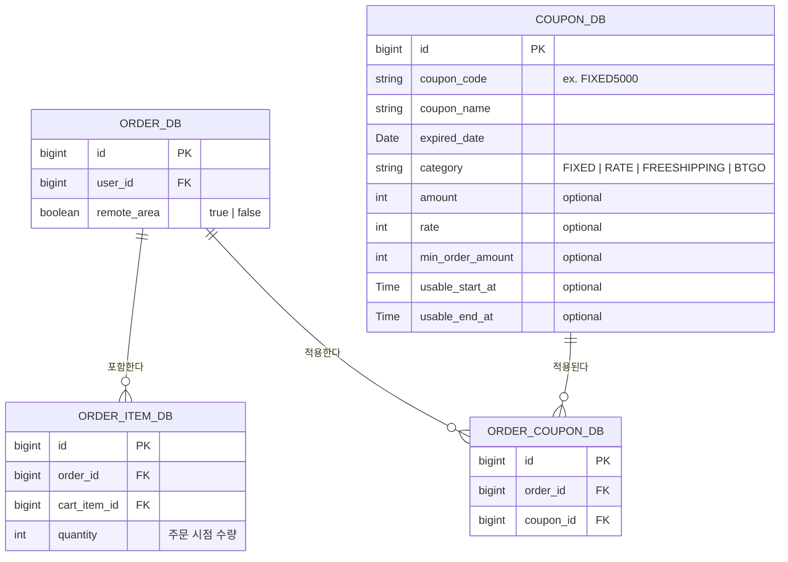

# 요구사항 명세서

- SSOT 상태 설계
  - 주문화면 페이지
    - GET `/checkouts/:checkoutId` (SSOT)
      - PATCH 배송정보 -> cache invalidate
      - PATCH 쿠폰 사용 -> cache invalidate
    - 모달 열림 상태
  - 쿠폰 모달
    - GET `쿠폰예상할인금액` (SSOT)
      - 쿠폰 체크박스 토글 -> cache invalidate

- 장바구니 (`/cart`)
  - [ ] 주문확인을 누르면 임시오더가 생성된다.
    - [ ] 성공시 주문확인페이지로 이동한다

- 주문 확인 (`/checkout/:checkoutId`)
  - [ ] 새로고침해도 주문확인 페이지에 남아있어야 한다
    - [ ] 임시오더를 발급한다.
    - [ ] 페이지에서 이탈하면 임시오더를 삭제한다.
  - [ ] 제주도서산간 선택시 → 배송비가 3000원 추가된다. (기본 3000원 + 제주도서산간 3000원 = 6000원)
    - [ ] 주문금액이 10만원 이상이면 무료배송이다.
    - [ ] 무료배송 쿠폰/조건은 `shipping_fee`를 0으로 만드는 방식이다. 즉 기본 지역은 3000원, 제주도서산간은 6000원만큼 `shipping_fee`가 차감되며, 이 금액은 `coupon_discount`(쿠폰할인액)에는 포함되지 않는다.
  - [ ] 페이지 진입시 최대 혜택이 계산된 금액이 쿠폰 할인금액에 표시되어야 한다.
    - [ ] 선택된 쿠폰 중 '무료배송'이 있다면, 배송지정보에 따라 할인가격이 변동되어야 한다.
  - 쿠폰모달
    - [ ] 기본적으로 최대혜택을 제공하는 쿠폰이 선택되어있어야 한다.
    - [ ] 체크여부에 따라 유동적으로 할인예상액이 변동되어야 한다. (할인 적용 버튼에 띄움)
    - [ ] 최대 2개 선택이 가능하다.
    - [ ] `MIRACLESALE` 할인(정률)은 할인된 금액에 적용된다. (후순위)
    - [ ] 이미 무료배송조건을 만족하는 경우에는 무료배송쿠폰은 선택할 수 없다.
    - [ ] 최소주문금액을 만족하지 못하는 쿠폰은 선택할 수 없다
    - [ ] 사용가능시간 조건을 만족하지 못하는 쿠폰은 선택할 수 없다
    - [ ] BTGO 조건에 충족하는 상품이 없는 경우 BTGO 쿠폰은 선택할 수 없다.
    - [ ] '사용하기 버튼'을 누르지 않고 모달을 닫는 경우, 서버에 저장되어 있는(ORDER_COUPON_DB) 적용 쿠폰 값으로 복구된다.

- 결제확인(결제성공되고 나서 보여야 하는 화면) (`/order-success`)
  - [ ] 종류와 개수, 최종 결제금액 (쿠폰 적용 후)
  - [ ] 주문 확인 페이지에서만 접근 가능해야함. → 뒤로가기하면 장바구니 페이지로 이동. 장바구니에서는 구매한 제품은 안보여야 함

## DB

> 전체 스키마는 [server/docs/db.md](../../server/docs/db.md) 참고. (정규화된 ORDER_DB / ORDER_ITEM_DB / ORDER_COUPON_DB 기준)



## API 명세서

### 주문

#### 주문 생성

- Description: 장바구니에서 선택된 아이템을 주문한다.
- Method: `POST`
- URI: `/checkouts`
- Request Body

```json
{
  items: [
    {
      product_id: number
      quantity: number
    }, ...
  ]
}
```

- Response

```json
{
  checkout_id: number,
}
```

- Status Code

```
201: 성공

400: quantity가 1이상 99이하여야 함. (음수, 0, 100이상)
400: 재고수량보다 많은 수량을 주문
404: 존재하지 않는 product를 주문
404: 카트에 존재하지 않는 product를 주문
```

#### 주문 조회

- Description: 결제를 위한 주문을 조회한다.
- Method: `GET`
- URI: `/checkouts/:checkoutId`
- Response

```json
{
  checkout_id: number
  items: [
    {
      product_id, name, price, quantity, image_url
    }, ...
  ],
  coupons: [
    { coupon_id, name, expired_date, min_order_amount, usable_start_at, usable_end_at,
      is_selected, // 선택여부
      disabled, // 선택가능여부
    }, ...
  ]
  remote_area: true | false // 제주도서산간여부
  checkout_amount // 주문금액
  coupon_discount // 쿠폰할인금액
  shipping_fee // 배송비
  total_amount // 총결제금액
}
```

- Status Code

```
200: 성공
```

#### 주문 취소

- Description: 주문 페이지에서 이탈시 임시 checkout db에서 checkout이 삭제된다.
- Method: `DELETE`
- URI: `/checkouts/:checkoutId`
- Response

```json
{}
```

- Status Code

```
204: 성공시 반환값 없음
```

#### 제주도서산간여부 수정

- Description: 제주도서산간 체크박스에서 호출되는 api
- Method: `PATCH`
- URI: `/checkouts/:checkoutId/address`
- Request Body

```json
body: {
  remote_area: true | false
}
```

- Response

```json
{}
```

- Status Code

```
204: 성공시 반환값 없음
```

#### 쿠폰 적용하기

- Description: 유저가 선택한 쿠폰을 주문에 적용한다.
- Method: `PATCH`
- URI: `/checkouts/:checkoutId/coupons`
- Request Body

```json
body: {
  coupons: [1], // [number, number?] | null. 적용: [1] 또는 [1,2] (최대 2개), 전체 해제: null
}
```

- Response

```json
{}
```

- Status Code

```
204: 성공시 반환값 없음

404: 존재하지 않는 coupon을 사용한 경우
400: coupon 조건을 만족하는지 (유효기간, 사용가능시간, 최소주문금액 만족인지, BTGO 쿠폰이면 개수도 만족하는지)
```

#### 쿠폰 할인액 계산하기

- Description: 체크된 쿠폰 조합으로 할인되는 금액을 계산한다.
- Method: `GET`
- URI: `/checkouts/:checkoutId/coupons/discount-preview?couponIds=:couponId1&couponIds=:couponId2`
- Response

```json
{
  "coupon_discount": 000 // 예상 할인액
}
```

- Status Code

```
200: 성공

404: 존재하지 않는 coupon을 사용한 경우
400: coupon 조건을 만족하는지 (유효기간, 사용가능시간, 최소주문금액 만족인지, BTGO 쿠폰이면 개수도 만족하는지)
```

> 400 발생 시 클라이언트는 `GET /checkouts/:checkoutId`를 다시 fetch하여 최신 쿠폰 선택가능 상태(disabled)로 동기화한다.

### 결제

#### 결제 정보 전송

- Description: 선택된 쿠폰/배송정보로 최종 결제를 처리한다
- Method: `POST`
- URI: `/checkouts/:checkoutId/payment`
- Request Body

```json
{
  remote_area,
  coupons,
}
```

- Response

```json
response: {
  item_count,
  total_quantity,
  total_amount,
}
```

- Status Code

```
200: 성공

404: 존재하지 않는 coupon을 사용한 경우
404: 존재하지 않는 product를 구매하려는 경우
400: coupon 조건을 만족하는지 (유효기간, 사용가능시간, 최소주문금액 만족인지, BTGO 쿠폰이면 개수도 만족하는지)
400: 재고보다 많은 수량을 구매하려는 경우
```
